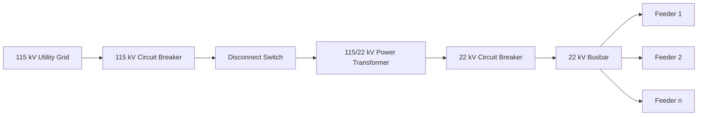

```mermaid
flowchart LR
    U[115 kV Utility Grid]
    CB1[115 kV Circuit Breaker]
    DS1[Disconnect Switch]
    TR[115/22 kV Power Transformer]
    CB2[22 kV Circuit Breaker]
    BUS[22 kV Busbar]
    F1[Feeder 1]
    F2[Feeder 2]
    F3[Feeder n]

    U --> CB1 --> DS1 --> TR --> CB2 --> BUS
    BUS --> F1
    BUS --> F2
    BUS --> F3

```
