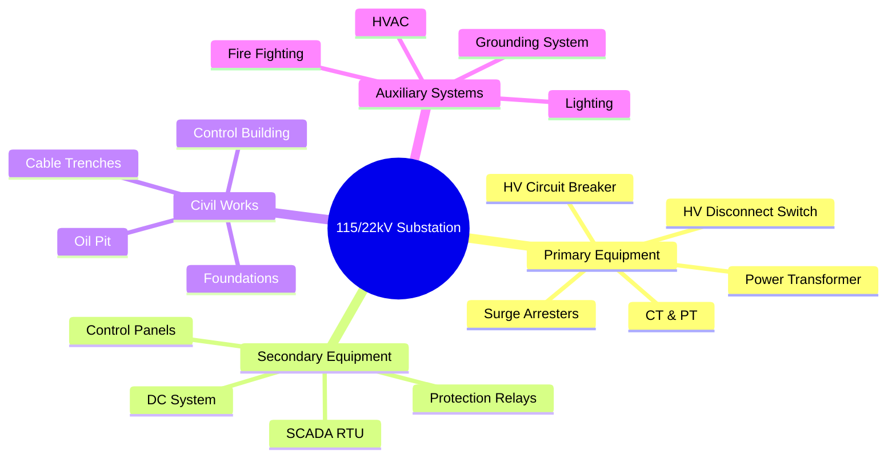

```mermaid
mindmap
  root((115/22kV Substation))
    Primary Equipment
      Power Transformer
      HV Circuit Breaker
      HV Disconnect Switch
      CT & PT
      Surge Arresters
    Secondary Equipment
      Protection Relays
      Control Panels
      SCADA RTU
      DC System
    Civil Works
      Control Building
      Foundations
      Cable Trenches
      Oil Pit
    Auxiliary Systems
      Fire Fighting
      Grounding System
      Lighting
      HVAC
```
