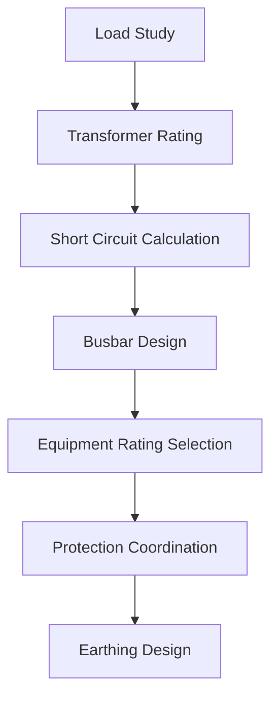

```mermaid
flowchart TD
    A[Load Study] --> B[Transformer Rating]
    B --> C[Short Circuit Calculation]
    C --> D[Busbar Design]
    D --> E[Equipment Rating Selection]
    E --> F[Protection Coordination]
    F --> G[Earthing Design]
```
