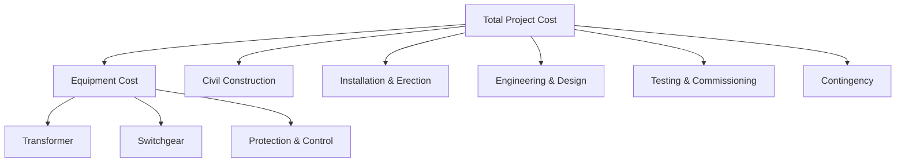

```mermaid
flowchart TD
    A[Total Project Cost]
    A --> B[Equipment Cost]
    A --> C[Civil Construction]
    A --> D[Installation & Erection]
    A --> E[Engineering & Design]
    A --> F[Testing & Commissioning]
    A --> G[Contingency]

    B --> B1[Transformer]
    B --> B2[Switchgear]
    B --> B3[Protection & Control]
```
