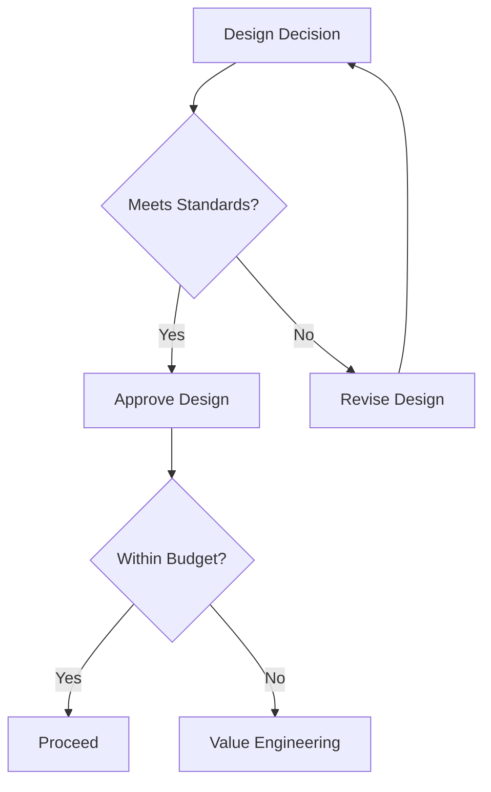

```mermaid
flowchart TD
    A[Design Decision] --> B{Meets Standards?}
    B -- Yes --> C[Approve Design]
    B -- No --> D[Revise Design]
    D --> A
    C --> E{Within Budget?}
    E -- Yes --> F[Proceed]
    E -- No --> G[Value Engineering]
```
